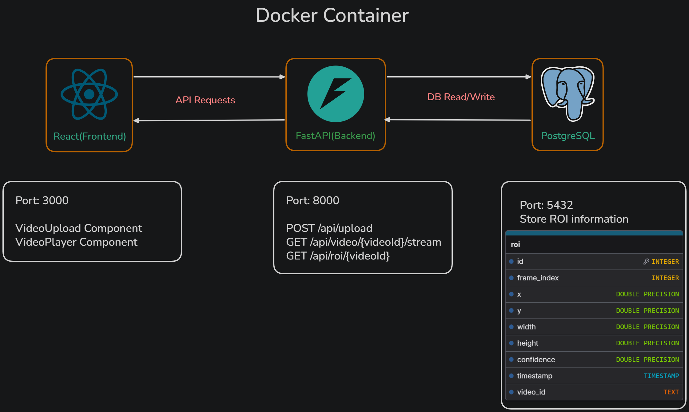

# Face Detection Video Streaming System

A containerized backend API that accepts video uploads, processes frames to detect faces, draws ROI bounding boxes, stores detection data in PostgreSQL, and returns the processed video via a React frontend.

## Architecture



## Tech Stack

| Layer | Technology |
|-------|------------|
| **Backend** | Python, FastAPI, SQLAlchemy, MediaPipe, Pillow, FFmpeg (via imageio) |
| **Frontend** | React, Vite, Tailwind CSS (dark theme) |
| **Database** | PostgreSQL 18 |
| **Containerization** | Docker, Docker Compose |

## API Endpoints

| Method | Path | Description |
|--------|------|-------------|
| `POST` | `/api/video/upload` | Upload a video file for face detection processing |
| `GET` | `/api/video/{video_id}/stream` | Download the processed MP4 video with ROI overlay |
| `GET` | `/api/roi/{video_id}` | Retrieve ROI bounding box data for a processed video |
| `GET` | `/health` | Health check endpoint |

## ROI Data Schema

```json
{
  "video_id": "uuid-string",
  "total_frames": 150,
  "rois": [
    {
      "id": 1,
      "frame_index": 0,
      "x": 120,
      "y": 85,
      "width": 200,
      "height": 250,
      "confidence": 0.95,
      "timestamp": "2026-05-04T12:00:00Z",
      "video_id": "uuid-string"
    }
  ]
}
```

## Quick Start

### Prerequisites

- Docker and Docker Compose installed

### Build and Run

```bash
# Build all services
docker compose build

# Start all services (backend, frontend, postgres)
docker compose up -d

# View logs
docker compose logs -f

# Stop all services
docker compose down
```

### Access the Application

- **Frontend:** [http://localhost:3000](http://localhost:3000)
- **Backend API:** [http://localhost:8000](http://localhost:8000)
- **API Docs:** [http://localhost:8000/docs](http://localhost:8000/docs)

### Docker Commands

```bash
# Build specific service
docker compose build backend
docker compose build frontend

# Rebuild after code changes
docker compose up -d --build

# View backend logs
docker compose logs backend

# View database logs
docker compose logs db

# Stop and remove volumes
docker compose down -v
```

## Configuration

### Environment Variables

| Variable | Default | Description |
|----------|---------|-------------|
| `DATABASE_URL` | `postgresql://faceuser:facepass@db:5432/facedb` | PostgreSQL connection string |
| `HOST` | `0.0.0.0` | Backend bind address |
| `PORT` | `8000` | Backend port |

Create `backend/.env` to override defaults.

## Development

### Backend

```bash
cd backend

# Create virtual environment
python3 -m venv venv
source venv/bin/activate

# Install dependencies
pip install -r requirements.txt

# Run the server
uvicorn app.main:app --reload
```

### Frontend

```bash
cd frontend

# Install dependencies
npm install

# Start dev server
npm run dev

# Run tests
npm test

# Build for production
npm run build
```

## Processing Pipeline

1. **Upload** — User uploads video via `POST /api/video/upload`
2. **Extract** — Frames extracted via `imageio` + FFmpeg
3. **Detect** — MediaPipe FaceDetector runs on every 5th frame (CPU optimization)
4. **Draw** — Red bounding box drawn via Pillow if confidence > 0.80
5. **Store** — ROI data saved to PostgreSQL
6. **Encode** — Processed frames encoded to MP4 via FFmpeg
7. **Stream** — User views processed video in `<video>` element via `GET /api/video/{id}/stream`

## Project Structure

```
face-detection/
├── docker-compose.yml
├── architecture.png
├── generate_architecture.py
├── backend/
│   ├── Dockerfile
│   ├── requirements.txt
│   ├── .env.example
│   └── app/
│       ├── __init__.py
│       ├── main.py              # FastAPI application
│       ├── config.py            # Environment configuration
│       ├── database.py          # SQLAlchemy setup
│       ├── models.py            # ROI database model
│       ├── schemas.py           # Pydantic schemas
│       ├── detector.py          # MediaPipe face detection
│       ├── models/
│       │   └── blaze_face_short_range.tflite
│       ├── routes/
│       │   ├── __init__.py
│       │   └── video.py         # Video upload, stream, ROI endpoints
│       └── uploads/             # Processed video storage
│   └── tests/
│       ├── test_api.py
│       ├── test_detector.py
│       └── test_schemas.py
└── frontend/
    ├── Dockerfile
    ├── nginx.conf
    ├── package.json
    ├── vite.config.js
    └── src/
        ├── main.jsx
        ├── App.jsx
        ├── App.test.jsx
        ├── index.css
        ├── api/
        │   └── client.js
        ├── components/
        │   ├── VideoUpload.jsx
        │   ├── VideoUpload.test.jsx
        │   ├── VideoPlayer.jsx
        │   └── VideoPlayer.test.jsx
        └── test/
            └── setup.js
```

## Running Tests

```bash
# Backend tests
cd backend
source venv/bin/activate
python -m pytest tests/ -v

# Frontend tests
cd frontend
npm test
```
